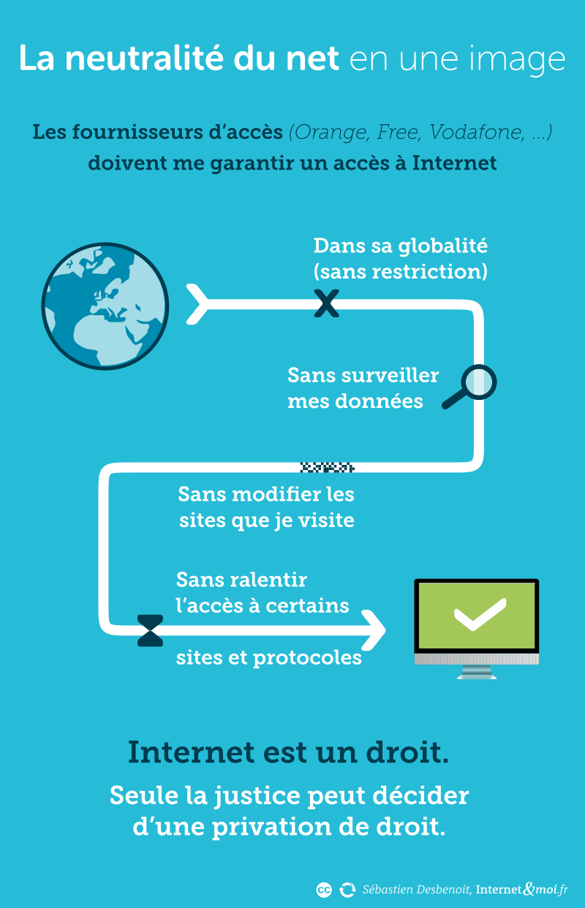

```{r setup, include=FALSE}
knitr::opts_chunk$set(echo = TRUE)
```

```{r logo, echo=FALSE, out.width = '100%', fig.align = "center",fig.cap="Logo Chatons"}

```

Ce cours est dispnible à l'adresse suivante : <https://mooc.chatons.org/mod/lesson/view.php?id=35>, @noauthor_1_nodate

# Définition

La neutralité du Net est le principe qui garantit l’égalité de traitement des données qui circulent sur le réseau. Ce principe, qui remonte aux premiers développements d’Internet, exclut par exemple toute discrimination positive ou négative à l'égard de la source, de la destination ou du contenu de l'information transmise sur le réseau. Ainsi, ce principe garantit que les utilisateurs et utilisatrices ne feront face à aucune gestion du trafic internet qui aurait pour effet de limiter ou améliorer leur accès aux applications et services distribués sur le réseau. Le principe de la neutralité du net garantit la neutralité du réseau et évite qu’internet ne devienne une sorte d’autoroute à plusieurs vitesses.

« La neutralité du net, c’est dire que les gens qui contrôlent les tuyaux, c’est à dire les fournisseurs d’accès à Internet, n’ont pas leur mot à dire sur les contenus qui passent par les tuyaux » nous explique Serge Abiteboul, chercheur à l’Inria.


# Les enjeux autour de la neutralité du net

Il y a donc deux enjeux principaux autour de la neutralité du net.

Le premier est lié à nos libertés individuelles fondamentales : chacun a le droit de lire et de publier du contenu sur internet, en respectant la loi bien sûr, sans qu’un FAI ne décide de ce qui est prioritaire. La neutralité du net, en assurant l'égal traitement des flux d'information, permet de garantir que l'accès au réseau ne dépend pas des ressources financières des utilisateurs et utilisatrices. Acteurs commerciaux et non-commerciaux sont sur un pied d'égalité. Chacun est libre de s'exprimer librement, dans les limites fixées par la loi, et d'accéder à l'information ou aux services qui lui plaisent, qu'ils soient payants ou non. Aussi, l'ensemble des sources d'information disponibles sur internet représente ainsi une diversité bien plus grande que celle permise par les médias traditionnels, ce qui constitue un progrès démocratique notable.

Le second aspect est celui de la concurrence économique. Garantir la neutralité du net, c’est éviter qu’une entreprise donne un avantage à un service plutôt qu’à un autre, sous prétexte, par exemple, que ce service a accepté de payer pour être prioritaire. En effet, les fournisseurs d'accès à internet sont généralement des sociétés commerciales privées attendant un rapide retour sur investissement. Ils sont aussi souvent producteurs de contenus : sites internet, vente en ligne, fourniture de services de vidéo à la demande, etc. Sans une neutralité du net encadrant leurs pratiques, leur tendance naturelle serait de privilégier les utilisateurs et utilisatrices de leurs propres sites et services voire d’introduire des priorités selon les formules tarifaires de leurs abonnés.


```{r photo1, echo=FALSE, out.width = '70%', fig.align = "center",fig.cap="La neutralité du net en une image"}

```


# La neutralité du net en péril

Alors que les équipements techniques du réseau Internet rendent possible depuis les années 2000 une gestion sélective, voire discriminatoire, du trafic, d'importants débats politiques ont lieu depuis le début de la décennie 2010 pour décider si ce principe doit être garanti par la législation.

Les fournisseurs d’accès à Internet, appuyés en cela par les industries culturelles (qui fournissent du contenu), voudraient notamment être en mesure de :

contenir l’accroissement de la demande en bande passante en ralentissant certains usages intensifs en bande passante, telle la vidéo à la demande ;
développer de nouveaux modèles économiques donnant naissance à un Internet à plusieurs vitesses, en donnant une priorité de transport à certains services et applications contre rémunération.
Il faut également noter le développement d’autres types d’atteintes au principe de neutralité du Net. C’est le cas notamment des mesures administratives de filtrage et de blocage de sites Internet, qui se développent dans le monde et en Europe, notamment en matière de contenus pédopornographiques.

# Une protection législative tardive

La neutralité du Net est garantie en Europe depuis le printemps 2016. Le règlement 2015/2120 du 25 novembre 2015 établissant des mesures relatives à l’accès à un internet ouvert prévoit à son art. 3 que : « Dans le cadre de la fourniture de services d’accès à l’internet, les fournisseurs de services d’accès à l’internet traitent tout le trafic de façon égale et sans discrimination, restriction ou interférence, quels que soient l’expéditeur et le destinataire, les contenus consultés ou diffusés, les applications ou les services utilisés ou fournis ou les équipements terminaux utilisés. »

En France, la loi n° 2016-1321 du 7 octobre 2016 pour une République numérique qui transpose le règlement européen 2015/2120 du 25 novembre 2015 établissant des mesures relatives à l’accès à un internet ouvert confie à l'Autorité de régulation des communications électroniques et des postes (Arcep) la mission de protéger la neutralité de l'internet (art. L. 33-1 du code des postes et des communications électroniques).

Ainsi, même si à ce jour dans notre pays,  la neutralité du net est protégée, nous ne sommes jamais à l'abri de nouvelles dérives. Ainsi, aux États-Unis, le 14 décembre 2017, la Federal Communications Commission (FCC), dont le nouveau président Ajit Varadaraj Pai a été nommé par le président Donald Trump, a mis un terme, par un vote, à la garantie d’un traitement égal des flux de données par les opérateurs. Cette décision de la FCC est entrée en vigueur le 11 juin 2018, mettant fin à la neutralité du réseau aux États-Unis. En avril 2019, la Chambre des représentants vote le Save The Internet Act, afin de rétablir le principe de neutralité du Net aboli en juin 2018 .

# Pour aller plus loin ...

L'ouvrage les Réseaux sociaux et Cie - Le commerce des données personnelles de @leroy_reseaux_2013 permet d'en apprendre plus sur le commerce des données personnelles.


***Bibliographie***


