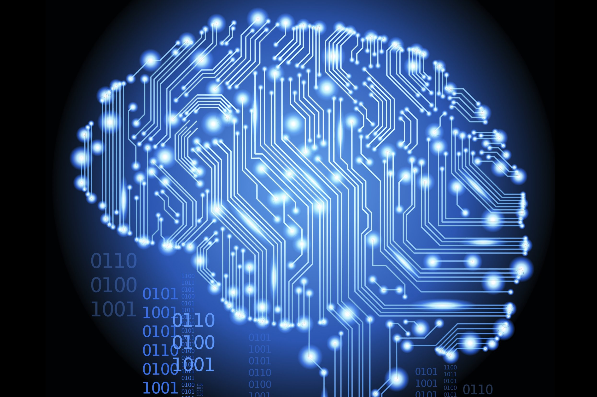
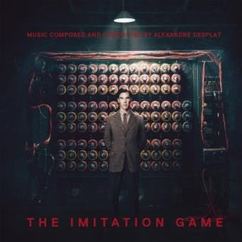
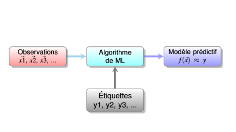

```{r setup, include=FALSE}
knitr::opts_chunk$set(echo = TRUE, fig.pos= "h")
library(ade4)
library(FactoMineR)
library(bookdown)
library(knitr)
library(factoextra)
library(tibble)
```

```{r logo, echo=FALSE, out.width = '70%', fig.align = "center",fig.cap="Intelligence artificielle"}

```

&nbsp;

*Résumé* : Dans ce rapport, nous allons résumer nos aquisitions sur l'intelligence artificielle, suite [au cours](https://github.com/vnzPayet/OPEN-exo/blob/master/GALMICHE-NEYRET/Introduction+IA.pdf) de M. Berteletti donné durant module OPEN 2020.  


&nbsp;

 **Chemin d'accès aux données **
 Les données sont téléchargeables directement sur [ce site](https://isaranet.fr/), elles sont accessibles aux étudiants de la promotion 49 ISARA, en suivant le chemin: Cours en ligne > Ingénieur > 2019-2020 > Module D > OPEN 
 
```{r datatemp, echo = TRUE}
link <- "http://factominer.free.fr/course/donnees/AnaDo_JeuDonnees_TemperatFrance.csv"
datatemp <- read.table(link, h=TRUE, sep=";", dec=".", row.names=1, encoding="latin1")
```


# **Historique - Les grands acteurs**

La notion d'objet intelligent a été mentionnée pour la première fois dans l'Iliade, puis dans différents mythes. Les permiers automates, eux, ont été créés au XVIIIe siècle, puis n'ont fait que se développer jusqu'au XXe siècle. les automates et machines ont toujours intrigué et passionné les scientifiques. 

La vraie révolution de l'intelligence artificielle arrive avec Alan Turing et la Seconde Guerre Mondiale. En effet, celui-ci a développé une machine capable de décrypter le code utilisé par les Allemands pour communiquer. Cette machine a ensuite donné lieu à la Bombe pour déchiffrer Enigma et le test de Turing.Ses travaux ne seront connus et reconnus que dans les années 70, plusieurs années après sa mort. Il fut reconnu héros de guerre et gracié à titre posthume en 2013 par la reine Elisabeth II.

```{r image, echo=FALSE, out.width = '50%', fig.align = "center",fig.cap="Alan Turing et sa machine"}

```

&nbsp;

Les permiers langages de programmation ont ensuite été développés dans les années 1950. S'en sont suivies les démonstrations logiques automatiques, le tout avec d'importants financements militaires. Puis le développement de traductions automatiques et simulations de psychothérapie. Au fil des années, de nombreuses tentatives d'amélioration se sont succédées, avec ou sans succès, jusqu'à nos jours avec des utilisations concrètes possibles.

A l'heure actuelle, nous sommes notamment capables de reconnaissance et synthèse vocales, traduction automatique de qualité, reconnaissance et synthèse d'images, navigation, avertissement, automatisme, développement de robots, etc ....
Nous avons donc un développement des Intelligences Artificielles spécialisées et applicables à quasiment tous les moments de la vie qutoidienne.

# **Les grands principes de l'IA**

L'IA se base sur la Data Science, qui fait référence aux mathématiques, aux statistiques, à l'informatique, à la modélisation, au piratage, à l'expertise, à l'ingénieurie et aux méthodes scientifiques.

Elle se base également sur le Big Data, comprenant les 3V qui sont: Volume, Variété et Vélocité.


L'IA actuelle se base sur diffrentes phases d'apprentissage: 


```{r graph, echo=FALSE, out.width = '50%', fig.align = "center", fig.cap="Phases apprentissage"}

```

# **Les phases **

# **Références**

*Liens* 

https://github.com/vnzPayet/OPEN-exo/blob/master/GALMICHE-NEYRET/Introduction+IA.pdf

https://isaranet.fr/

&nbsp;

*Bibliographie* 

