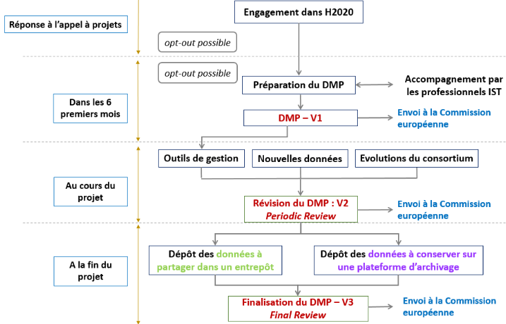

```{r setup, include=FALSE}
knitr::opts_chunk$set(echo = TRUE)
```
\newpage

# Introduction

Le contexte national et européen des infrastructures de recherche favorise de plus en plus des politiques de gestions des données. En effet, pour être inscrit sur les feuilles de route nationale et européenne, les instituts sont dans l’obligation d’avoir une telle politique. Les données produites doivent répondre à des objectifs fixés dont notamment celui de l’ouverture des données. 

De telles politiques sont donc mises en place au niveau institutionnel, au sein de l’Inra. La charte de l’institut repose sur les six valeurs suivantes : « ouverture, partage, transparence, accès aux données, soutenabilité financière et conformité. », [@inra_charte_2016]. En effet, en signant la déclaration de Berlin en 2004 qui incite à rendre l’information scientifique librement accessible, l’Inra est entré dans une démarche Open Science. Cette démarche permet d’ouvrir les données de la recherche et de les rendre accessibles à tous. L’objectif est de capitaliser les efforts expérimentaux de chacun et d’éviter les duplications. Cela permettrait d’augmenter l’efficacité de la recherche. 

La loi Lemaire « Pour une République Numérique » du 7 octobre 2016 incluant la problématique des données de la recherche, renforce la démarche Open Science déjà mise en place. Découle de cela une charte publiée par l’Inra pour le libre accès à ses publications et données scientifiques en février 2017. Cette charte comprend sept points de recommandations destinés aux chercheurs afin de les inciter à entrer dans la démarche Open Science [@inra_linra_2016].

D’autre part, depuis quelques années, avec la révolution du numérique et l’acquisition de jeux de données toujours plus conséquents, l’Inra s’est fixée des objectifs Open Sciences. Ces objectifs comprennent :  
-	L’organisation des infrastructures de recherche afin qu’elles soient connectés  
-	L’organisation des données pour faciliter leur partage et leur réutilisation notamment grâce à la création d’un portail de données et de collaborations avec le CEA, le CNRS ainsi que l’Inria et l’Irstea  
-	Favoriser les approches prédictives en biologie et en écologie   
-	Proposer de nouveaux modes de diffusion de la connaissance notamment en adaptant les revues propriétaires à la science ouverte mais également en encourageant des modèles alternatifs de publications.  
-	Adapter le métier et l’environnement du chercheur au numérique en demandant des compétences en analyse de jeu de données massifs par exemple ou encore en améliorant le processus de dématérialisation.  

En outre, Horizon 2020, le programme de financement de la recherche et de l’innovation de l’Union européenne pour la période 2014-2020 s’inscrit lui aussi dans cette démarche de science ouverte. En effet, toutes les publications issues de projets financés par ce programme doivent être en libre accès. De plus, il existe un pilote ORD : Open Research Data qui tend à rendre accessibles le plus de données possibles acquises dans le cadre d’un projet H2020 [@ministere_de_lenseignement_superieur_de_la_recherche_et_de_linnovation_libre_2014].

Enfin, en 2018, apparaît le plan national pour la science ouverte qui « rend obligatoire l’accès ouvert aux publications ainsi qu’aux données issues de recherches financées sur projet ». Ce plan est composé de 3 axes décrivant des mesures afin de « généraliser l’accès ouvert aux publications », « structurer et ouvrir les données de la recherche » ainsi qu’afin de « s’inscrire dans une dynamique durable, européenne et internationale » [@ministere_de_lenseignement_superieur_de_la_recherche_et_de_linnovation_plan_2018].

Cette synthèse présentera donc les modalités liées à l’Open Science, comment s’inscrire dans cette démarche de valorisation des données. Pour cela, une première partie abordera les enjeux de l’accessibilité aux données tandis que la partie suivante se verra plus techniques et permettra de donner un cadre de gestion des données au sens large, toujours dans un objectif d’open science. 

\newpage

# I.	Les enjeux de l’accessibilité aux données scientifiques

L’open data est un concept récent parfois encore mal connu du personnel scientifique. Les enjeux de l’ouverture des donnés sont multiples, que ce soit pour les personnes ou les instituts producteurs de données ou pour les utilisateurs des données [@aumont_datapartage_2017].

## 1.	Enjeux patrimoniaux

Inciter les chercheurs à rendre leurs données accessibles permet tout d’abord d’éviter de perdre des données. En effet, de nombreuses données sont encore dans des formats non pérennes voir peut-être non lisibles car trop vieux pour être remis à jour. 

De plus, de nombreux chercheurs n’ont plus connaissance des lieux de stockage des données acquises au long de leur carrière ou n’ont pas toujours pris le temps nécessaire pour stocker leur données correctement. En effet, il est estimé qu’environ 80% des données sont perdues 20 ans après publication [@roberge_les_2015]. 

D’autre part, le problème du stockage des données est d’autant plus important pour des chercheurs ayant travaillé dans plusieurs instituts différents au cours de leur carrière. 

De plus, dans le cas où les supports de stockage sont encore disponibles et lisibles par d’autres scientifiques, les données sont parfois trop peu décrites à l’aide de métadonnées pour être comprises et réutilisées par d’autres. 

Enfin les données apparaissant dans les publications sont généralement des données traitées et il est souvent difficile de retrouver les données brutes initiales à partir de celles-ci. Or, l’accessibilité à des données plus anciennes est impérative dans certains domaines comme la météorologie par exemple ou tous les domaines concernant l’évolution des sols.

## 2.	Enjeux économiques 

Tout d’abord, il est inutile que les fonds de l’Etat financent des expérimentations supplémentaires sur un projet alors que les données produites par d’autres instituts pourraient être en partie réutilisées car complémentaires. L’Open data (données ouvertes) permet donc « d’accélérer l’innovation et le retour sur Investissement dans la R&D » [@ist_datapartage_2018]. 

A titre d’exemple, on peut citer l’institut européen de bio-informatique (EMBL-EBI), organisation intergouvernementale fournissant gratuitement des données dans le monde entier. Les avantages sont estimés à 1 milliards de livres sterling par an pour les utilisateurs et leurs bailleurs de fonds ce qui correspond à 20 fois le coût opérationnel de l’institut [@beagrie_value_2016].

## 3.	Enjeux scientifiques

D’une part, l’accessibilité aux données garantit une certaine qualité. En effet, de nombreuses questions se posent actuellement sur la qualité des productions scientifiques et notamment sur le niveau de signification statistique des conclusions tirées. Il semblerait que seulement 20% seraient statistiquement fiables [@aumont_datapartage_2017]. En publiant les données brutes, la recherche peut s’affranchir de ce risque, les données étant la preuve de l’exactitude de la publication. Plus les données seront vues et réutilisées par des collaborateurs et plus le risque d’erreurs ou de conclusions hâtives sera évité. 

De plus, en amont, le chercheur qui publiera ses données sera plus attentif. Toutefois, publier ses données entraîne de nombreux changements techniques pour la communauté scientifique et de nouvelles responsabilités.  
Pour l’institut de recherche qu’est l’INRAE, l’accessibilité aux données permet d’assurer l’intégrité de ses recherches et produits.

D’autre part, l’accessibilité des données peut être une passerelle entre les instituts de recherche, producteurs de données, et les instituts techniques, utilisateurs de données. En effet, chaque année, 7% des adresses mail des chercheurs ne sont plus fonctionnelles ce qui rend plus difficile l’accès aux informations. De plus, l’Open data permettrait également de faciliter l’usage des données notamment par ces communautés techniques.

Enfin, l’ouverture des données les rend citables et améliore la vitesse d’accessibilité à ces dernières. Découle de cela un taux de citation pouvant être plus important ce qui est dans l’intérêt des producteurs de données qui voient leur travail reconnu. 

## 4.	Enjeux sociétaux

Comme il a été écrit précédemment, l’Open data permet une traçabilité des données et garantit une certaine qualité. L’accessibilité aux données contribue donc à améliorer l’image de la recherche auprès des citoyens ainsi qu’à augmenter leur confiance et donc leur participation à la science (sciences participatives).

En termes d’éducation, les jeux de données publiés pourraient permettre à des étudiants de les intégrer à leurs productions pour argumenter ou encore de s’entraîner sur de vraies données.

L’Open data permettrait donc de nouveaux liens entre citoyens et instituts de recherche.

## 5.	Enjeux éthiques

L’ouverture des données nécessite de bien réfléchir en amont à la question « Quelles données publier ? ». En effet, d’un point de vue éthique et juridique les chercheurs se doivent de respecter les droits d’auteurs, la vie privée et selon le domaine il est parfois possible de rencontrer des obligations de secret ou de sécurité.
Selon le type de données, l’ouverture ne sera donc pas toujours possible notamment pour des données personnelles ou encore des données concernant le domaine de la santé par exemple.

\newpage

# II.	Gérer des données

Les principaux risques dans la gestion des données reposent sur l'obsolescence matérielle, logicielle ou encore du format de fichier ainsi que la perte de son contenu. On peut également citer d'autres risques plus secondaires tels qu'un mauvais lieu de rangement ou encore un mauvais nommage des fichiers. Cette partie comprend donc des explications sur la manière dont il est possible de s'affranchir de ces risques afin que les données respectent les principes FAIR (les données doivent être trouvables, accessibles, interopérables et réutilisables). 

La première étape dans la gestion durable des données consiste à établir un plan de gestion des données [@marie_claude_quidoz_les_2018].

## 1.	Etablir un plan de gestion des données (PGD)

Un plan de gestion des données est un document formel et évolutif qui décrit de façon synthétique toutes les étapes du cycle de vie de la donnée : de la collecte à l’archivage et au partage, basé sur les principes FAIR. Ce document est considéré comme une bonne pratique de gestion et permet de gagner en temps et en efficacité ainsi que de prévoir au mieux le budget à allouer aux données. Le plan de gestion n’est pas figé mais évolutif au cours du projet et se remplit pendant et après le projet.

Dans le cadre d’un projet financé par H2020, tout scientifique doit participer à l’action pilote ORD : « Open Research Data » soit en français « libre accès aux données issues de la recherche » sauf exception si les données ne peuvent être partagées pour des raisons de sécurité ou autre. Dans ce cas, ce choix devra être motivé. Toutefois, il est possible de participer au pilote ORD (voir même vivement conseillé) bien que la totalité des données ne soit pas rendue accessible. Le principe de l’ORD concernant l’accessibilité des données est *« as open as possible, as closed as necessary »*. 

Tout participant à l’action pilote ORD doit obligatoirement fournir un PGD à la commission européenne dans les 6 mois qui suivent le commencement du projet. Il est également recommandé de soumettre à titre volontaire un plan de gestion des données pour les projets se désengageant du pilote. Une nouvelle version du DMP est nécessaire en cas de modifications significatives du projet tel que l’acquisition de nouvelles données, la déposition d’une demande de brevet, des arrivées ou départs de membres,… Dans le cas d’une évaluation périodique, le PGD mis à jour doit-être fournit. Dans tous les cas, un examen final à lieu où la version finale du PGD doit être soumise.

Afin d’aider les participants au projet pilote ORD, un modèle de plan de gestion de données applicable à tout projet H2020 est proposé par la commission européenne. Ce modèle est basé sur les principes FAIR et comporte 6 parties composées chacune d’une série de questions. Un seul DMP doit être réalisé par projet même si celui-ci contient plusieurs jeux de données. Néanmoins tous les jeux de données doivent apparaître dans le PGD. 

Afin d’aider la communauté scientifique française dans ses démarches un outil collaboratif est mis à disposition par l’Inist-CNRS : DMP OPIDoR (Data Management Plan pour une Optimisation du Partage et de l’Interopérabilité des Données de la Recherche). Cet outil est basé sur le code open source DMPRoadmap. Des instituts peuvent ajouter leur propre PGD comme c’est le cas de l’INRAE [@doranum_presentation_2018]. DMP OPIDoR permet de partager le PGD avec des collaborateurs et offre des sauvegardes automatiques sur un serveur en France. Toutefois, pour avoir toutes les versions du PGD il est fortement recommandé de l’exporter [@filatre_realiser_2017].


```{r logo, echo=FALSE, out.width = '100%', fig.align = "center",fig.cap="Marche à suivre en terme de plan de gestion des données dans le cadre d'une participation au pilote ORD. A. Cartier, M. Moysan, N. Reymonet, d’après les Guidelines on FAIR data management."}

```


## 2. Documenter et organiser les données

Cette partie est très importante, que ce soit pour l’auteur ou l’utilisateur des données. En effet une bonne gestion des règles de nommage, d’organisation et de renseignements des métadonnées permet de gagner en intelligibilité et d’accroître largement le potentiel de réutilisation des données.

###   Nommage et organisation des fichiers et dossiers

Le nommage et l’organisation des fichiers (ou dossiers) de données permettent un gain de temps considérable, que ce soit pour l’auteur pendant le projet qui peut plus facilement localiser et distinguer les fichiers que pour l’utilisateur lorsqu’il veut réutiliser les données. Une organisation structurée et un nommage clair permettent donc de faciliter le partage des jeux de données.
En outre, cela permet également de réduire les risques de suppression ou de déplacements malencontreux et donc de préserver l’intégrité des données [@pole_donnees_de_la_recherche_ist_datapartage_2016].

Concernant le nommage, il est tout d’abord conseillé de choisir une convention de nommage adaptée aux fichiers et aux contenus. Cette convention doit être appliquée pour tous les fichiers et toujours de la même façon. Il est préférable d’écrire cette convention quelque part afin de pouvoir s’y référer lors du nommage de nouveaux fichiers ou pour mieux (re)comprendre les titres des fichiers nommés ultérieurement.
Quelques règles de bases :  

-	Le nom de fichier doit être court : l’INRA recommande au maximum 25 caractères [@ist_datapartage_2018]. Les noms de fichiers peuvent inclure des abréviations, dans ce cas il est préférable de choisir des abréviations usuelles telles que par exemple AP pour Avant-Projet, CR pour Compte Rendu, VP pour Version Provisoire, VF pour Version Finale,... Il est aussi possible et conseillé d’y faire figurer les initiales du chercheur ainsi que le numéro de version ou encore la date. Attention cependant à ce dernier point, les dates doivent avoir un format consistant de type *AAAA-MM-JJ* selon la norme ISO 8601 [@unil_regles_2016]. Les fichiers doivent être identifiables par leurs noms même en cas de changement du lieu de stockage.

-	Il est impératif d’éviter les caractères spéciaux ainsi que les accents, les cédilles ou encore les espaces. Ces derniers peuvent être remplacés par des underscores ou encore des tirets [@unil_regles_2016]. Attentions certaines applications ne font pas la différence entre majuscules et minuscules donc supprimer les espaces en les remplaçant par des majuscules en début de mot n’est pas toujours pertinent [@ist_datapartage_2018]. 

-	Dans le cas d’une numérotation il est préférable d’utiliser des zéros devant le numéro. Par exemple il vaut mieux écrire 001, 010, 100 plutôt que 1, 10, 100. Cette règle permettra d’assurer le bon ordre leur dans leur affichage [@unil_regles_2016].  

-	Il est également conseillé de ne pas garder toutes les versions intermédiaires d’un même fichier afin d’éviter les confusions.

Concernant l’organisation de l’arborescence, il est recommandé d’établir un plan de classement pour les projets impliquant plusieurs personnes. Idéalement, tous les collaborateurs doivent participer à son élaboration [@laperdrix_plan_2016]. Pour l’élaboration d’un tel plan, il est conseillé d’aller du plus général au plus spécifique et de mettre en place une organisation durable, qui ne serait pas impactée par des changements quelconques [@arseneau_comment_2015].

Enfin, afin d’éviter tout problèmes de stockage et de perte de fichiers, il est conseillé d’utiliser la règle du 3-2-1 à savoir : produire 3 copies, sur 2 supports différents dans au moins 1 lieu distant [@marie_claude_quidoz_les_2018].


###   Documenter les données

Afin de documenter les données, des métadonnées sont utilisées. Etymologiquement métadonnées signifie « données sur les données », c’est en fait un ensemble de données structurées permettant de décrire, expliquer, localiser les données afin que celles-ci soient plus compréhensibles. Elles permettent d’appliquer les principes FAIR et donc de faciliter [@doranum_metadonnees_2017], [@inist_tutoriels_2018] : 

-	**L’accessibilité** : elles favorisent la recherche des données notamment grâce à la recherche multicritères.  

-	**L’interopérabilité** : elles doivent permettre aux données d’être interprétables par des humains comme par des machine.  

-	**La pérennité** : les métadonnées doivent permettre de documenter les éventuelles migrations d’un format de document à un autre

-	**La réutilisation** : elles permettent une meilleure gestion et organisation des productions scientifiques notamment grâce à l’identification de l’auteur et la définition des usages.

Les métadonnées répondent généralement aux questions : « *Quoi ?* », « *Où ?* », « *Quand ?* », « *Comment ?* », « *Pourquoi ?* » et définissent [@inist_tutoriels_2018] :

-	Le contexte de production : protocoles expérimentaux, procédés de traitement et d’analyse, auteur, date, localisation, objectifs de la collecte des données, financeur. 

-	Le contenu intellectuel : définitions, titre, résumé, domaine de recherche, mots-clés, type de ressource.  

-	Les caractéristiques techniques des données : format de fichiers, taille, organisation, liens.  

-	Les propriétés et droits d’usage : détenteur des droits, licence, droits d’exploitation, conditions d’accès, outils spécifiques.

Ces métadonnées peuvent être embarquées ou bien externes, c’est-à-dire dans un catalogue d’accompagnement par exemple ou encore un annuaire d’entrepôt. 

Elles peuvent être gérées par plusieurs approches différentes : 

-	Un tableau de type Excel par exemple : cette approche, bien que largement utilisée, est déconseillée car elle ne prend pas en compte la sémantique et ne permet pas de faire des requêtes facilement. Un tableau construit dans un format csv est préférable car il permet l’interopérabilité (lisible par humains et machines).  

-	Une structure en arbre de type xml : cette approche permet une meilleure organisation des métadonnées ainsi que la possibilité de lier des concepts avec d’autres.  

-	Un graphique sémantique avec des triplets RDF : les métadonnées sont organisées de façon structurées et cette approche permet la prise en compte de la sémantique.

Il existe des standards de métadonnées ainsi que des modèles de métadonnées LovInra compatibles avec l’AgroPortal. Ces standards donnent une trame à suivre pour la description des données. On les choisit en fonction de la destination des données (certains entrepôts ont leurs propres standards)  ou encore par domaines spécifiques. 

Pour aider les chercheurs dans leur démarche, le site internet du DCC (Digital Curation Center) et celui du RDA (Research Data Alliance) proposent des listes de standards de métadonnées et d’outils d’aide à la description. Le site FAIRsharing propose également des standards de métadonnées selon la discipline étudiée. Il est nécessaire d’indiquer les standards utilisés pour les jeux de données dans le DMP.  
Ces standards peuvent être sous forme de schémas ayant pour avantages d’indiquer les relations existants entre les différentes métadonnées. Dans le cas d’un schéma de métadonnées il est souvent nécessaire d’utiliser le format xml permettant une structuration en arborescence.  

Les schémas sont composés de 4 parties décrivant chaque élément :  
-	la signification (auteur, date, titre,…)  
-	le contenu (nombre, texte)  
-	la formulation (« Nom, Prénom », texte libre, norme ISO 8601)   
-	la valeur  

Un schéma définit également le caractère obligatoire des métadonnées (obligatoire, recommandé et facultatif), les règles d’ajout d’éléments ainsi qu’éventuellement des règles plus spécifiques (obligation de renseigner tel champ si tel autre champ est rempli par exemple). Il est possible d’utiliser le schéma DataCite par exemple ou encore Dublin Core qui est générique et qui a fait l’objet d’une norme ISO (certifié ISO 9001). 

Au sein de ces schémas les métadonnées peuvent être décrites à l’aide de vocabulaire contrôlé, de thésaurus ou encore d’ontologies qui sont respectivement des listes de termes prédéfinis, des répertoires structurés de termes et « un ensemble structuré de termes et concepts représentants le sens d’un champ d’informations ». Ces outils améliorent la visibilité des données ainsi que leur réutilisation. 

En agronomie, il est possible d’accéder à ces outils de description déjà existants en passant par exemple par l’Agroportal.

###   Identifier les données

Dans le cadre du projet H2020, il est obligatoire de « faire référence à un système standard d’identification », [@linnovation_programme_2016].  

On utilise donc un identifiant pérenne (PID) afin d’identifier ses données ou même plus largement les contributeurs et auteurs du jeu de données. Le PID sont des identifiants uniques et pérennes permettant d’associer chaque jeu de données à une ressource ou entité. Ce sont en quelques sortes les équivalents des URL dans le web. 

Toutefois, les URL ne sont pas des identifiants stables contrairement aux PID car la ressource n’est plus accessible dès lors qu’elle est déplacée ou renommée. La gestion active des PID par des infrastructures humaines et techniques permet d’éviter ce problème. 

Il existe deux types d’identifiants pérennes : objets et contributeurs.

\newpage

# Conclusion

Afin de s’inscrire dans une démarche Open science et donc de produire des données FAIR, la première étape indispensable est l’établissement d’un plan de gestion des données qui décrira les grandes lignes des différentes étapes de leur cycle de vie. Dès la collecte des données, il est nécessaire de définir les données pouvant être partagées de celles devant rester confidentielles. Le nommage et l’organisation des fichiers ainsi que la documentation des données qu’ils contiennent à l’aide de métadonnées, idéalement issues de standards, doivent également être réalisés dès la collecte. Il est nécessaire que les fichiers soient dans un format le plus pérenne possible adapté aux données qu’ils contiennent. Tout au long de la collecte et du traitement des données, les fichiers doivent être stockés et sauvegardés dans un entrepôt de stockage par exemple. A la fin du projet, les données doivent être archivées de manière pérenne dans un entrepôt prévu à cet effet ou une plateforme d’archivage. Il est possible de valoriser son travail en publiant ses données dans un journal ou encore sur le web des données.

\newpage

# References

