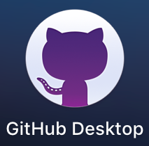
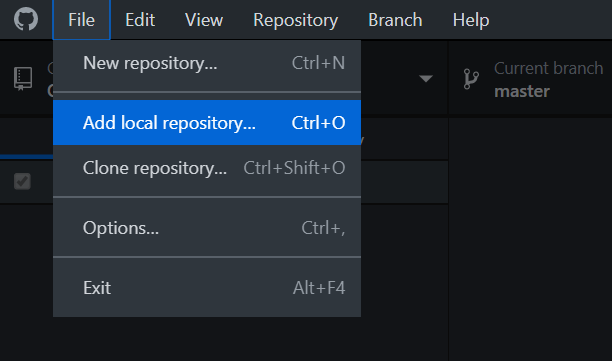
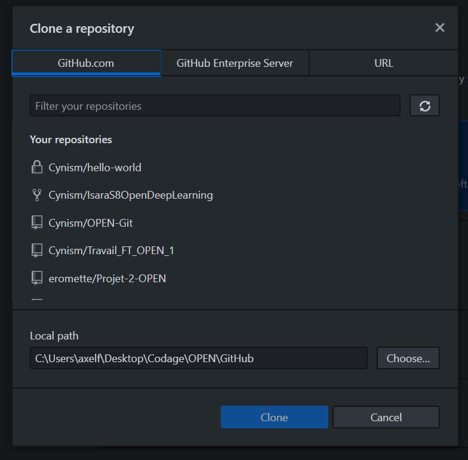
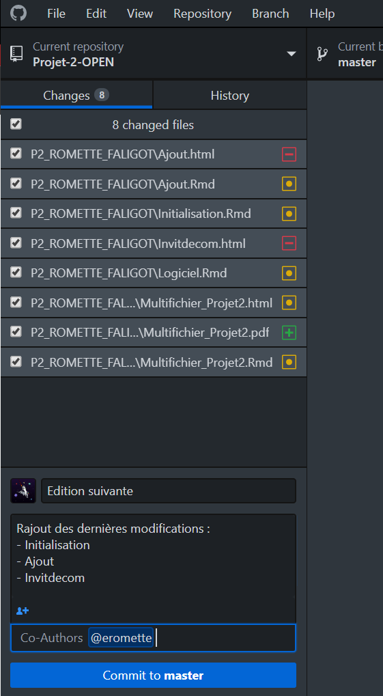
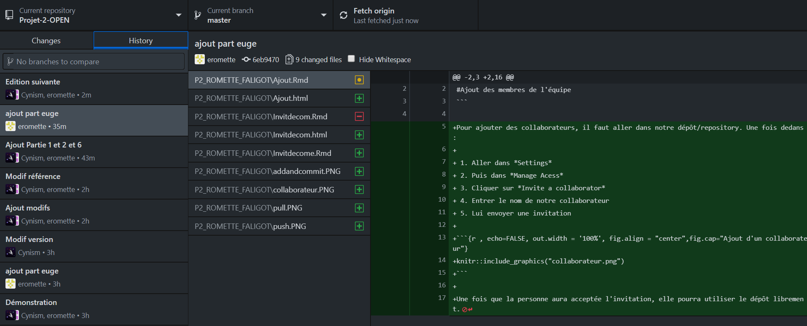
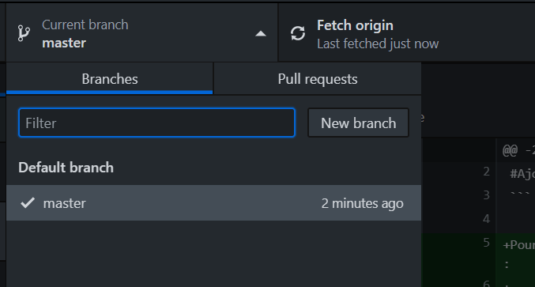
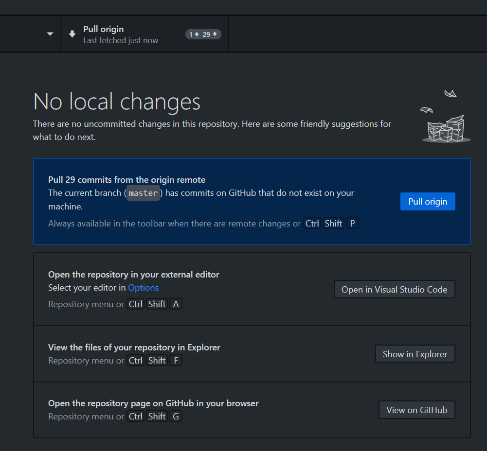

```{r,echo=FALSE}
#Utilisation de GitHub Desktop
```

## *Explications :*

Intéressons-nous à l'utilisation d'un logiciel permettant de simplifier l'usage de GitHub.
En effet, la console peut sembler quelque peu... *perturbante* pour les néophytes.
GitHub a par conséquent développé un outil simplifiant l'usage de Git : GitHub Desktop *`*tadaaaam*`*

```{r pic0, echo=FALSE, out.width = '30%', fig.align = "center"}

```
&nbsp;

Ce outil permet de remplacer l'utilisation de la console de commande par une interface intuitive de gestion.

## *Lancement du logiciel :*
Vous devez tout d'abord vous connecter à votre compte GitHub.  

Ici, vous avez la possibilité de créer un répertoire pour ensuite le synchroniser avec votre compte GitHub via : `New repository`.  
Il est par ailleurs possible d'ajouter un dossier local (sur votre ordi) comme répertoire en ligne GitHub via : `Add local repository`.  
Enfin, option qui nous intéresse le plus : la capacité de cloner un répertoire depuis le compte en ligne GitHub sur votre ordinateur via `Clone repository`.  

```{r pic4, echo=FALSE, out.width = '80%', fig.align = "center"}

```
&nbsp;

*****************************************************************

## *Cloner un répertoire :*

Lors du clonage d'un répertoire, vous avez 3 onglets :  
- *`GitHub.com`* vous permet de sélectionner un répertoire que vous possédez déjà sur votre compte en ligne, que ce soit un répertoire à vous, un où vous êtes autorisés à éditer ou un *fork*, c'est à dire un suivi des mises à jour d'un répertoire d'une personne, sans pour autant y avoir la possiblité de l'éditer.  
Une fois le répertoire sélectionné, vous pouvez choisir l'emplacement d'enregistrement via *`Local path`* puis *`Browse`*.  
- *`GitHub Enterprise Server`* sert dans le cadre d'une entreprise, nous ne nous y intéressons pas.  
- *`URL`* vous permet de faire comme le premier onglet sauf qu'au lieu de choisir de cloner un répertoire venant de votre compte en ligne, vous avez la possibilité de directement le cloner via un lien qui vous a été fourni par le propriétaire.

```{r pic5, echo=FALSE, out.width = '80%', fig.align = "center"}

```
&nbsp;

*****************************************************************

## *Commit de fichiers :*

Une fois votre répertoire ajouté, vous pouvez le sélectionner en haut à gauche via la petite flèche dans la liste *`Current respository`*.  

L'avantage de ce logiciel est qu'il enregistre en temps réel les modifications effectuées dans le répertoire.  
Ainsi, il est possible de voir sur cet exemple des fichiers qui ont été :  
- supprimés : le carré rouge  
- modifiés : le carré orange  
- ajoutés : le carré vert    

Il est possible de choisir, via les case à cocher sur le côté à gauche, les fichiers qui seront synchronisés entre le répertoire local et le répertoire en ligne accessible à tout ceux qui ont les droits.  

En bas se trouve une zone permettant d'effectuer les *`commits`*, c'est à dire les indications de mise à jour des fichiers du répertoire.  
Ainsi, ici on observe que l'utilisateur *`Cynism`* a effectué un commit :  
- contenant tous les fichiers cochés au dessus    
- ayant pour titre : *`Edition suivante`*  
- ayant pour description détaillée le détail des modifications  
- ayant pour co-auteur : *`eromette`*, lui permettant d'apparaitre dans l'historique des commits.    

Une fois ceci rempli, il est possible de lancer le commit, ici dans la branche *`master`*.
Pour synchroniser le commit et les fichiers avec la version en ligne, il est nécessaire de *`push`* (expliqué peu après).


```{r pic7, echo=FALSE, out.width = '80%', fig.align = "center"}

```
&nbsp;

*****************************************************************

## *Historique des commits :*

L'interface permet de voir l'historique des changements effectués sur le répertoire :    
- les noms des auteurs  
- la date/heure  
- le nom du commit  
  - le contenu par commit (les changements apportés)  
    - les changements apportés au sein de tous les fichiers par commit  
      - en vert : ce qui a été ajouté  
      - en rouge : ce qui a été enlevé  
      - en gris : ce qui n'a pas été modifié  

```{r pic8, echo=FALSE, out.width = '80%', fig.align = "center"}

```
&nbsp;

*****************************************************************

## *Le principe de "branch" :*
Lors d'une édition par plusieurs personnes d'un même répertoire, dans le cas où l'on souhaiterai partir sur des versions différentes avec les mêmes bases, ou versions non finies nécessitant encore des modifications, il est possible de créer des *`branchs`*.  
La principale se nomme *`master`* et contient le fichier principal.  
Il est possible d'en créer une (ou d'en sélectionner une) en cliquant sur *`Current branch`* puis en choisissant celle que l'on veut éditer ou en créer une.  
Lorsque l'on souhaite fusionner 2 branches, il suffit de faire une *`Pull request`*, c'est à dire une demande de fusion des branches.  
Il y aura toutefois auparavant une annonce sur l'accueil du logiciel comme quoi il est possible de fusionner des branches, et qu'il faut choisir laquelle sera fusionnée à laquelle.

```{r pic9, echo=FALSE, out.width = '80%', fig.align = "center"}

```
&nbsp;

*****************************************************************

## *Effectuer un push/pull :*

### <ins> Push <ins> :  

Lorsqu'un commit a été effectué, il suffit de cliquer, dans le menu principal, sur le bouton qui s'appelle *`Push origin`*.  
Cela permettra de synchroniser le commit avec le répertoire en ligne et l'afficher dans l'historique.  
Sur l'image, il est indiqué *`Pull origin`*, toutefois cela peut aussi être *`Push`* ou *`Fetch origin`*, le premier permettant d'envoyer, le second de vérifier des changements.  


### <ins> Pull <ins> : 

Lorsque des modifications ont été apportées en ligne, il est nécessaire de récupérer les dernières versions via : *`Pull origin`*.  
Il est possible qu'il y ait des conflits, en ce cas le plus simple est d'aller dans le dossier concerné (manuellement), puis de supprimer le(s) fichier(s) qui pose souci, ou du moins le déplacer sur le Bureau si on souhaite le conserver.

```{r pic10, echo=FALSE, out.width = '80%', fig.align = "center"}

```
&nbsp;

*****************************************************************
