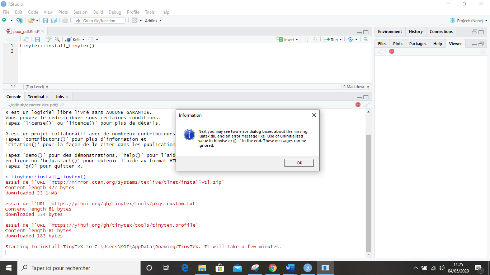
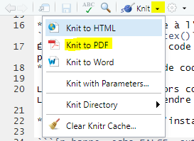

```{r setup, include=FALSE}
knitr::opts_chunk$set(echo = TRUE)
```

## Installation du package Tinytext

Avant de pouvoir éditer des pdf à partir de R, il est nécessaire d'installer **le package tinytext**. La marche à suivre est présentée ci-dessous :

* Ce package s'installe à l'aide de la ligne de code suivante : `tinytex::install_tinytex()`
Écrivez cette ligne de code dans R : cela signifie que vous allez installer le package Tinytex.
* Validez cette ligne de code en faisant *Ctrl + Entrée*

L'installation peut alors commencer. Plusieurs messages apparaissent. L'installation peut prendre plusieurs minutes.

* Laissez le package s'installer. Voici ce que vous devez voir à l'écran :

```{r barre, echo=FALSE, out.width = '80%', fig.align = "center",fig.cap="Installation du package TinyTex"}
knitr::include_graphics("capture1.png")
```

* Puis le message suivant s'affiche. Cliquez sur "ok" :

```{r clicok, echo=FALSE, out.width = '80%', fig.align = "center",fig.cap="Cliquez sur ok"}

```

Une fois l’installation terminée, fermez et redémarrez R.

Vous pouvez à présent faire un **"Knit" au format pdf**, en cliquant sur les boutons suivants :

* La flèche à droite du bouton *Knit*
* *Knit to PDF*
L'image suivante indique quels sont les boutons mentionnés ci-dessus :

```{r knitpdf, echo=FALSE, out.width = '45%', fig.align = "center",fig.cap="Knit au format PDF"}

```


## Including Plots

You can also embed plots, for example:

```{r pressure, echo=FALSE}
plot(pressure)
```

Note that the `echo = FALSE` parameter was added to the code chunk to prevent printing of the R code that generated the plot.
