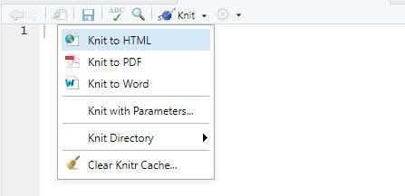

# **Installer Knitr**

A partir d’un document .rmd (rmarkdown), il est possible de générer (« knit ») des documents HTML, PDF, Word, GitHub markdown, etc…
Pour cela, nous utilisons le package Knitr.
Il faut donc s’assurer que le package Knitr est bien installé

* Tapez `install.packages("knitr")`

La console devrait afficher le message `knitr’ successfully unpacked and MD5 sums checked`

Ainsi nous pouvons générer des documents de différents formats (html, pdf, word, .md, ...)

# **Générer un PDF**


A partir d’un document .rmd (rmarkdown), il est possible de générer (« knit ») des documents HTML, PDF ou Word.
Nous verrons ici comment générer un document PDF.


* Cliquez sur la petite flèche l’icône Knit située dans la barre au dessus de votre script. Un menu déroulant apparaît, vous proposant les options « Knit to HTML », « Knit to PDF » et « Knit to Word ». 

``` {r logo, echo=FALSE, out.width = '50%', fig.align = "center",fig.cap="Menu déroulant 'Knit' "}

```


* Cliquez sur « Knit to PDF ».


# **Références**

*Liens* 

http://factominer.free.fr/course/donnees/AnaDo_JeuDonnees_TemperatFrance.csv   

<https://husson.github.io/data.html>


